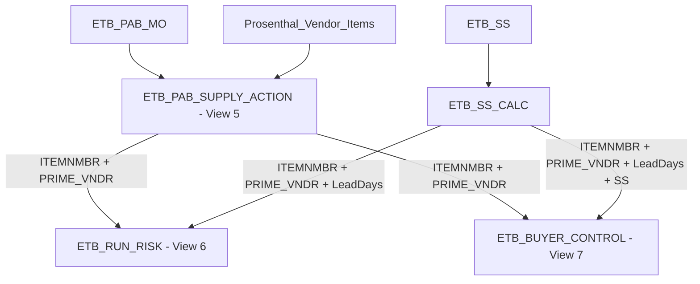

# Plan: Add Description, UOM, and Reliable Vendor to Views 6 & 7

## Problem Statement

[`06_etb_run_risk.sql`](sql/06_etb_run_risk.sql) and [`07_etb_buyer_control.sql`](sql/07_etb_buyer_control.sql) are missing `ItemDescription` and `UOM` columns. Additionally, the `PRIME_VNDR` field needs to be reliably sourced — it should come from either `ETB_SS_CALC` or `ETB_PAB_SUPPLY_ACTION` (whichever is populated), and must appear in the rollup output.

## Data Flow Context



## Column Availability

| Column | ETB_PAB_SUPPLY_ACTION - View 5 | ETB_SS_CALC |
|--------|-------------------------------|-------------|
| `ItemDescription` | ✅ Present | ✅ Present as implicit via join |
| `UOM` | ✅ Present | ✅ `PurchasingUOM` and `MfgUOM` |
| `PRIME_VNDR` | ✅ Present | ✅ Present |

## Changes Required

### View 6 — [`06_etb_run_risk.sql`](sql/06_etb_run_risk.sql)

**Current state**: Selects only `ITEMNMBR`, `PRIME_VNDR`, and aggregate risk metrics. No description or UOM.

**Changes**:

1. **Add `ItemDescription` and `UOM`** to the `threatened_clients_detail` CTE — pull from `ETB_PAB_SUPPLY_ACTION` which already has these columns
2. **Carry `ItemDescription` and `UOM`** through `client_summary`, `deficit_rows`, and `with_threat` CTEs
3. **COALESCE vendor**: In the `with_threat` CTE where `ETB_SS_CALC` is joined, use `COALESCE(p.PRIME_VNDR, ss.PRIME_VNDR)` to ensure vendor is always populated
4. **Add to final SELECT**: Include `ItemDescription` and `UOM` in the final output
5. **Update GROUP BY**: Add `ItemDescription` and `UOM` to `client_summary` GROUP BY, or aggregate them separately to avoid breaking the rollup

> **Design decision**: Since View 6 is a rollup at the `ITEMNMBR + PRIME_VNDR` level, `ItemDescription` and `UOM` should be consistent per item. Use `MAX(ItemDescription)` and `MAX(UOM)` in the aggregation CTEs to avoid adding them to GROUP BY and potentially changing cardinality.

### View 7 — [`07_etb_buyer_control.sql`](sql/07_etb_buyer_control.sql)

**Current state**: Selects `PRIME_VNDR`, `ITEMNMBR`, and aggregate buyer metrics. No description or UOM. Also has a syntax issue — the opening CTE `filter_supply` keyword is missing.

**Changes**:

1. **Fix syntax**: Add the missing `WITH filter_supply AS (` wrapper at the top
2. **Add `ItemDescription` and `UOM`** to the `filter_supply` CTE from `ETB_PAB_SUPPLY_ACTION`
3. **Carry through `risk_data`**: Use `MAX(fs.ItemDescription)` and `MAX(fs.UOM)` in the aggregation
4. **COALESCE vendor**: Use `COALESCE(fs.PRIME_VNDR, ss.PRIME_VNDR)` in the `risk_data` CTE
5. **Add to final SELECT**: Include `ItemDescription` and `UOM` in the output
6. **Update `PARTITION BY`**: The `Vendor_Total_Exposure` window function partitions by `PRIME_VNDR` — this should use the COALESCEd vendor alias

### Vendor COALESCE Strategy

The vendor should be resolved with this priority:
```sql
COALESCE(supply_action.PRIME_VNDR, ss_calc.PRIME_VNDR) AS PRIME_VNDR
```

This ensures:
- Primary source is `ETB_PAB_SUPPLY_ACTION` (the demand-side vendor from MO data)
- Fallback is `ETB_SS_CALC` (the safety stock calculation vendor from `ETB_SS`)
- The resolved vendor flows into all rollup aggregations and `PARTITION BY` clauses

## Implementation Steps

1. Edit [`sql/06_etb_run_risk.sql`](sql/06_etb_run_risk.sql):
   - Add `ItemDescription`, `UOM` to `threatened_clients_detail` SELECT
   - Carry `MAX(ItemDescription)`, `MAX(UOM)` through `client_summary`
   - Add `p.ItemDescription`, `p.UOM` to `deficit_rows`
   - COALESCE `PRIME_VNDR` in `with_threat` using `ETB_SS_CALC` fallback
   - Add `ItemDescription`, `UOM` to final SELECT

2. Edit [`sql/07_etb_buyer_control.sql`](sql/07_etb_buyer_control.sql):
   - Fix missing `WITH filter_supply AS (` syntax
   - Add `ItemDescription`, `UOM` to `filter_supply` SELECT
   - Add `MAX(fs.ItemDescription)`, `MAX(fs.UOM)` to `risk_data`
   - COALESCE `PRIME_VNDR` in `risk_data`
   - Add `ItemDescription`, `UOM` to final SELECT
   - Ensure `PARTITION BY` uses the resolved vendor

3. Test both views to confirm:
   - `ItemDescription` and `UOM` appear in output
   - Vendor is never NULL when either source has a value
   - Rollup totals like `Vendor_Total_Exposure` and `Total_Deficit_Qty` are unchanged
   - Row counts match pre-change baseline
